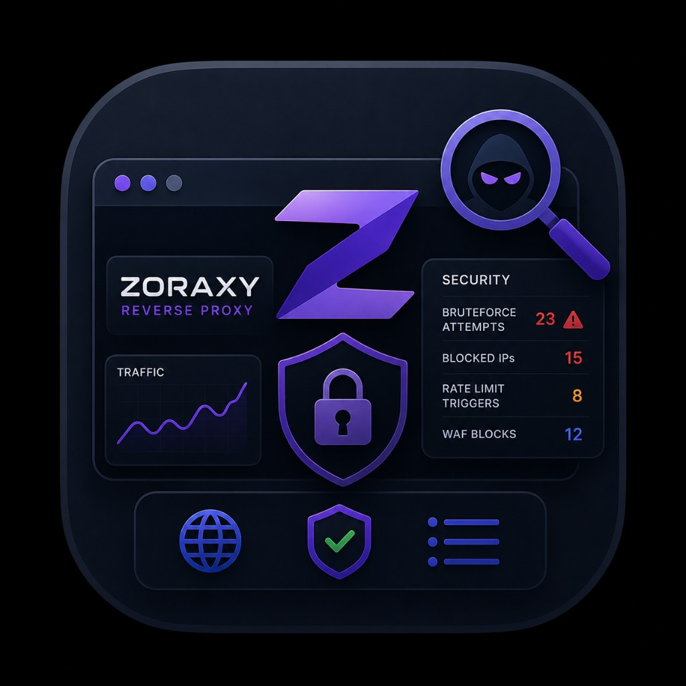

# Zoraxy Guard

Security-Monitor für [Zoraxy](https://github.com/tobychui/zoraxy)-Logs: Exploit-Pfade, Threat-Listen, Scanner-Lärm und Zugriffe, bei denen wirklich **Handlung nötig** ist.

<p align="center">
  
</p>

**Web-GUI:** Port **8787** (Deutsch)  
**Alarme:** Pushover, Discord, Telegram, Webhook  
**Image:** `ghcr.io/paulg67/zoraxy-guard:latest` (GitHub Actions bei Push auf `main`)

---

## Funktionen

- **Live-Tail** der Zoraxy-Logs (`zr_*.log`) ohne die History zu leeren
- **Risiko-Engine:** Scanner/403/Redirects vs. mögliche Leaks (HTTP 2xx auf verdächtige Pfade)
- **History:** gemeinsamer Memory-Ring (Status + History), Filter, Geo/ASN, Disk-Nachladen
- **Prüfen ↗:** öffnet Domain + Pfad im Browser; der eigene Folgeaufruf erzeugt **keinen** Alarm
- **Prüf-ID** (`ZG-…`) in Pushover und in der Web-UI — offene IDs per Dropdown oder eigene Eingabe als **geprüft** markieren
- **Geprüft-Reiter:** alle stummen Links, Filter nach Domain/Pfad/ID, Alarmierung wieder aktivieren
- **Push-Filter:** nur Handlungsbedarf, keine geblockten 403, keine bereits geprüften Fingerprints (einstellbar)
- Threat-Listen-Katalog, Allow-/Blocklist, sensible Hosts

---

## Unraid

### Updates (bestehender Container)

Docker → **zoraxy-guard** → **Force update** (zieht `ghcr.io/paulg67/zoraxy-guard:latest`).  
Kein Script nötig, sobald das Image auf GHCR liegt.

Icon der Vorlage: [unraid/icon.png](https://raw.githubusercontent.com/PaulG67/zoraxy-guard/main/unraid/icon.png)  
Wenn Docker noch das alte Bild zeigt: Container **Edit → Apply**, Browser-Cache leeren.

### Erstinstallation – einmal im Unraid-Terminal

```bash
bash <(curl -fsSL https://raw.githubusercontent.com/PaulG67/zoraxy-guard/main/unraid/install-template.sh)
```

Das Script:

1. legt `appdata/zoraxy-guard` und `config.yaml` an  
2. schreibt die User-Vorlage nach  
   `/boot/config/plugins/dockerMan/templates-user/my-zoraxy-guard.xml`  
3. zieht das Image von GHCR (Fallback: lokaler Build)

Danach in der Unraid-WebUI:

1. **Docker → Container hinzufügen**
2. **Template** → **zoraxy-guard**
3. Zoraxy-**Log-Pfad** prüfen (`…/zoraxy/log` mit `zr_*.log`)
4. Optional: `WEB_PASSWORD`, Pushover (`PUSHOVER_USER_KEY` + `PUSHOVER_API_TOKEN`)
5. **Apply**
6. GUI: `http://UNRAID-IP:8787`

Vorlage nach Icon-/XML-Änderung: Script erneut ausführen, dann Container **Edit → Apply**.

### Manuell ohne Script

```bash
mkdir -p /mnt/user/appdata/zoraxy-guard/data/{lists,feed-cache} \
  /boot/config/plugins/dockerMan/templates-user

curl -fsSL https://raw.githubusercontent.com/PaulG67/zoraxy-guard/main/config.example.yaml \
  -o /mnt/user/appdata/zoraxy-guard/config.yaml

curl -fsSL https://raw.githubusercontent.com/PaulG67/zoraxy-guard/main/unraid/my-zoraxy-guard.xml \
  -o /boot/config/plugins/dockerMan/templates-user/my-zoraxy-guard.xml

docker pull ghcr.io/paulg67/zoraxy-guard:latest
```

---

## Web-UI

| Seite | Funktion |
|---|---|
| **Status** | Memory-Banner, letzte Alarme, Prüfen-Link, Prüf-ID (Auswahl + Eingabe), Test-Alarm |
| **History** | Zugriffe im Ring, Filter (Erfolg/Fail, Handlungsbedarf, Lärm), Prüfen bei Handlungsbedarf, Reset & laden |
| **CrowdSec** | Blöcke des Zoraxy-CrowdSec-Add-ins (IPs, Pfade, Länder) |
| **Geprüft** | Stumme Links ohne Push, Filter nach Domain/Pfad/ID/Titel, «Alarmierung aktivieren» |
| **Konfiguration** | Logs, Listen, Schwellwerte, **welche Alarme gepusht werden** |
| **Listen** | lokale Blocklisten + Katalog-Update |

`config.yaml` muss **schreibbar** gemountet sein (GUI speichert dorthin).

### Alarme / Pushover

Unter **Konfiguration → Alarme** (Standard):

- nur **Handlungsbedarf** (kein 403-Scanner-Lärm)
- geprüfte Fingerprints nicht erneut senden
- geblockte 403/401/Blacklist nicht pushen
- viele Alarme in wenigen Minuten → **eine Sammelmeldung** (nicht mehrere Pushovers pro Sekunde)
- **Alarmierung pausieren** (Haken auf Status oder Konfiguration): kein Push, History läuft weiter

In der Pushover-Nachricht stehen **Prüfen**-Link und **ID: ZG-…**.  
Dieselbe ID in der Web-UI wählen oder eintippen → **Als geprüft markieren**.

Unter **Geprüft** siehst du alle stummen Links. Filter: Domain, Pfad, Titel, Prüf-ID, Freitext.  
**Alarmierung aktivieren** nimmt die Prüfung zurück — derselbe Vorgang kann wieder gepusht werden.

«Prüfen ↗» in Status/History: nächster Aufruf auf Domain+Pfad wird einmalig ignoriert (kein False-Positive durch dich selbst).

### CrowdSec (Zoraxy-Add-in)

CrowdSec blockt bekannte Angreifer-IPs mit HTTP 403, **bevor** sie deine Apps erreichen.  
Guard pusht diese Blöcke nicht (wie andere 403er). Alarme kommen weiter, wenn etwas **durchkommt** (z. B. Exploit-Pfad mit 2xx).  
Der Reiter **CrowdSec** wertet `plugin-manager`-Zeilen (`Request blocked`) aus. Dafür Plugin-Log-Level `info` (nicht nur `warning`) und ggf. History → Reset & laden.

---

## Docker Compose

```yaml
services:
  zoraxy-guard:
    image: ghcr.io/paulg67/zoraxy-guard:latest
    container_name: zoraxy-guard
    restart: unless-stopped
    ports:
      - "8787:8787"
    environment:
      TZ: Europe/Zurich
      WEB_PASSWORD: "change-me"
    volumes:
      - /mnt/user/appdata/zoraxy/log:/logs:ro
      - /mnt/user/appdata/zoraxy-guard/config.yaml:/config/config.yaml
      - /mnt/user/appdata/zoraxy-guard/data:/data
```

Env (optional): `DISCORD_WEBHOOK`, `PUSHOVER_USER_KEY` + `PUSHOVER_API_TOKEN`, `TELEGRAM_BOT_TOKEN` + `TELEGRAM_CHAT_ID`, `MIN_SEVERITY`

Beispiel-Config: [`config.example.yaml`](config.example.yaml)

---

## Threat-Listen

| Name | Quelle |
|---|---|
| `ipsum-level3` / `4` / `5` | IPsum |
| `spamhaus-drop` / `edrop` / `dropv6` | Spamhaus |
| `blocklist-de-all` / `ssh` / `apache` / `bruteforce` | blocklist.de |
| `cinsscore-ci-badguys` | CINS |
| `greensnow` | GreenSnow |
| `feodo-ip` / `sslbl-ip` | abuse.ch |
| `firehol-level1` / `2` | FireHOL |
| `tor-exit-nodes` | Tor (laut) |

Lokale Dateien: `/data/lists/` · zusätzlich `custom_lists` in der Config.

---

## License

MIT
